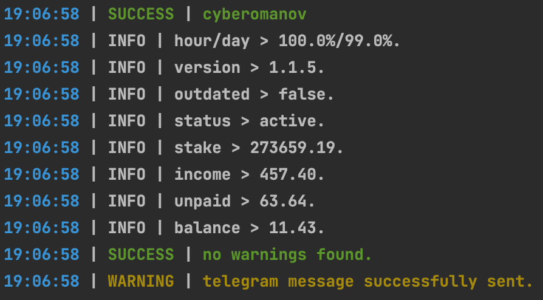
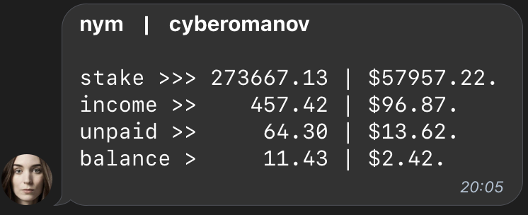
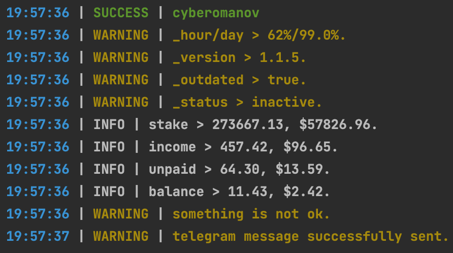
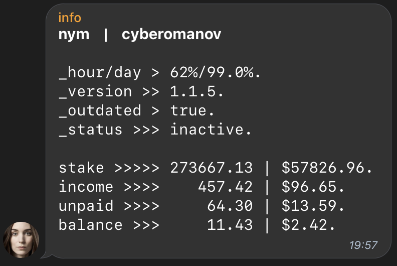

# NYM

this system will alert you with telegram about your mixnode/s status.<br>
[donations are welcome](https://cyberomanov.tech/WTF_donate), if you find this tool helpful.

## Contents
1. [Screenshots](https://github.com/cyberomanov/status-ping#screenshots)
2. [Installation](https://github.com/cyberomanov/status-ping#installation)
3. [Update](https://github.com/cyberomanov/status-ping#update)

### Screenshots

Log:
<p align="center">

<br> <br>

<br> <br>
</p>
Alarm:
<p align="center">

<br> <br>

</p>

### Installation

1. Create telegram bot via `@BotFather`, customize it and get `bot_API_token` ([how_to](https://www.siteguarding.com/en/how-to-get-telegram-bot-api-token)).
2. Create at least 2 chats: `alarm` and `log`. Customize them, add your bot into this chats and get `chat_IDs` ([how_to](https://stackoverflow.com/questions/32423837/telegram-bot-how-to-get-a-group-chat-id)).
3. Connect to your server where you plan to install nym-status-system.
4. Install `python3.10` or newer:
```
# one-line-command
sudo apt-get update && \
sudo apt-get upgrade -y && \
sudo apt install software-properties-common tmux curl git -y && \
sudo add-apt-repository ppa:deadsnakes/ppa && \
sudo apt-get install python3.10 python3-pip -y && \
sudo update-alternatives --install /usr/bin/python3 python3 /usr/bin/python3.8 1; \
sudo update-alternatives --install /usr/bin/python3 python3 /usr/bin/python3.10 2; \
sudo update-alternatives --config python3 && \
sudo apt-get install python3-distutils && \
sudo apt-get install python3-apt && \
sudo apt install python3.10-distutils -y && \
curl -sS https://bootstrap.pypa.io/get-pip.py | python3.10 && \
sudo apt-get install python3.10-dev -y && \
pip3 install --ignore-installed PyYAML && \
python3 -V

>>> Python 3.10.9
```
5. Clone this repository:
```
cd ~/ && \
git clone https://github.com/cyberomanov/status-nym.git status-nym && \
cd ~/status-nym/
```
6. Install requirements:
```
pip3 install -r ~/status-nym/requirements.txt
```
7. Edit `config.yaml`:
```
nano ~/status-nym/config.yaml
```
8. Run the `nym.py` to check you config settings:
```
python3 nym.py
```
9. If all seems okay, then edit your crontab with `crontab -e`:
```
# ping
*/10 * * * * cd /root/status-nym/ && /usr/bin/python3 status-nym.py
```
> check your logs in 5-10-15 minutes here: `~/status-nym/log/nym.log`
---------
### Update

1. backup your config:
```
cp ~/status-nym/config.yaml ~/config_temp.yaml
```
2. pull changes from the repository:
```
cd ~/status-nym/ && \
git fetch && \
git reset --hard && \
git pull
```
3. print a new default config:
```
cat ~/status-nym/config.yaml
```
4. restore your previous config, **ONLY** if there is no breaking changes, else edit the new file:
```
nano ~/status-nym/config.yaml

OR

mv ~/config_temp.yaml ~/status-nym/config.yaml
```
5. Install requirements:
```
pip3 install -r ~/status-nym/requirements.txt
```
6. Run the `nym.py` to check you config settings:
```
python3 nym.py
```
